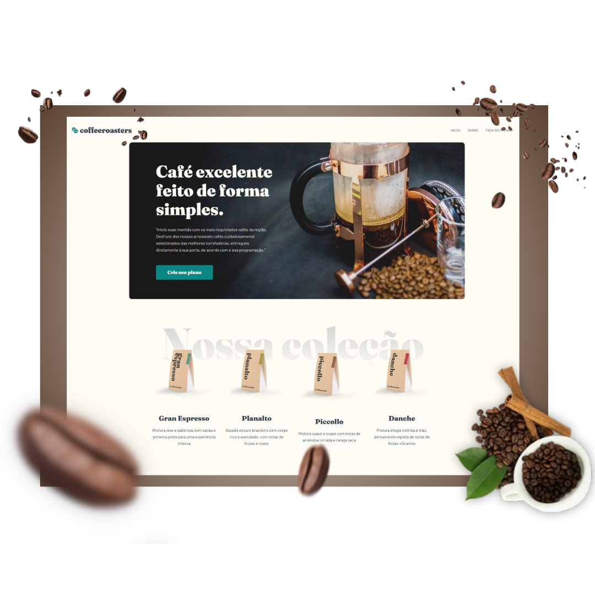

# Personalização de pedidos de café 
desafio front end mentor

Este repositório contém o código-fonte do projeto Coffeeroasters, um desafio proposto pelo site Frontend Mentor. Este README.md fornece uma visão geral completa do projeto, incluindo informações sobre sua finalidade, estrutura do projeto, tecnologias utilizadas, instruções de instalação, uso, contribuição e muito mais.

## Sumário

- [1. Visão Geral](#1-visão-geral)
- [2. Objetivos Principais](#2-objetivos-principais)
- [2. Tecnologias](#3-Tecnologias-utilizadas)
- [4. Instalação](#4-instalação)
- [5. Uso](#5-uso)
- [6. Contribuição](#6-contribuição)
- [7. Licença](#7-licença)

# 1. Visão Geral

O projeto Coffeeroasters é um desafio proposto pelo site Frontend Mentor, que consiste na implementação de um site para uma empresa fictícia de café chamada Coffeeroasters. O desafio inclui a criação de diferentes páginas, como a página inicial, página de planos de assinatura personalizados e outras, além de funcionalidades interativas.

## 2. Objetivos Principais

- **Demonstrar Habilidades Técnicas:** O portfólio visa destacar as habilidades técnicas em desenvolvimento web front-end, incluindo HTML, CSS e JavaScript, bem como seu conhecimento em bibliotecas e frameworks populares, como Angular e TypeScript.

- **Apresentar Projetos Relevantes:** Uma seção dedicada é reservada para exibir os projetos mais recentes e relevantes desenvolvidos por Ramon Dias. Cada projeto é acompanhado por uma breve descrição, capturas de tela e links para visualização ou repositório no GitHub.

- **Facilitar o Contato:** O portfólio inclui informações de contato de Ramon Dias, como endereço de e-mail e perfis em redes sociais e plataformas profissionais, para facilitar o contato de potenciais clientes, recrutadores ou colaboradores.

## 3. Tecnologias Utilizadas

O projeto Coffeeroasters utiliza uma combinação de tecnologias front-end e ferramentas de desenvolvimento, incluindo:

- **Angular 16:** Framework JavaScript utilizado para criar componentes reutilizáveis e facilitar o desenvolvimento de uma aplicação web dinâmica e responsiva.

- **HTML5 (HyperText Markup Language):** Utilizado para criar a estrutura e o conteúdo semântico do site.
  
- **CSS3 (Cascading Style Sheets):** Responsável pela estilização e aparência visual do portfólio, garantindo uma experiência de usuário atraente e responsiva em diferentes dispositivos e navegadores.

- **TypeScript:** Linguagem de programação que adiciona tipagem estática ao JavaScript, proporcionando um código mais seguro e manutenível.

## 4. Instalação

Para utilizar o projeto Coffeeroasters em sua máquina local, siga estas instruções:

1. Clone este repositório: `git clone https://github.com/euramondiaz/coffee-plan-create`
2. Navegue até o diretório do projeto: `cd coffee-plan-create`
3. Instale as dependências: `npm install`
4. Inicie o servidor de desenvolvimento: `ng serve`
5. Abra seu navegador e acesse `http://localhost:4200/` para visualizar o projeto.

## 5. Uso

Explore as diferentes seções do portfólio, incluindo "Sobre Mim", "Resumo", "Portfólio" e "Contato". Clique nos links e botões interativos para navegar entre as páginas e seções.

## 6. Contribuição

Se você deseja contribuir com este projeto, siga estas etapas:

1. Faça um fork deste repositório.
2. Crie uma branch para sua contribuição: `git checkout -b feature/sua-contribuicao`
3. Faça suas alterações e commit: `git commit -am 'Adicione sua contribuição'`
4. Faça push para a branch: `git push origin feature/sua-contribuicao`
5. Abra um pull request.

## 7. Licença

Este projeto está licenciado sob a [Licença MIT](LICENSE), o que significa que você pode usá-lo livremente, modificar e distribuir, incluindo em projetos comerciais. Consulte o arquivo LICENSE para obter mais informações.

Este projeto foi desenvolvido por [RAMON DIAS](https://github.com/euramondiaz).
 

